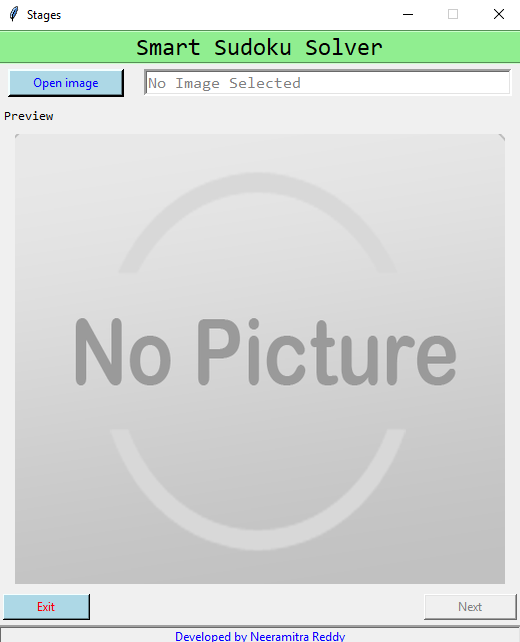
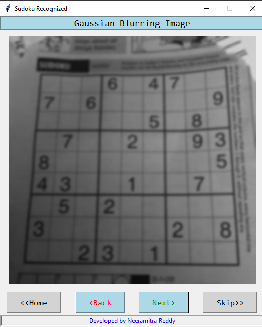
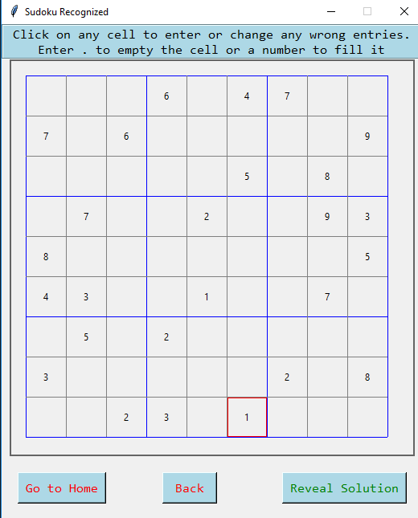
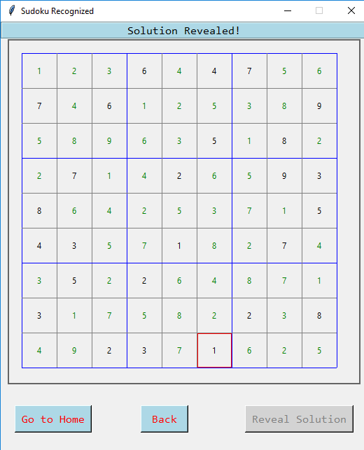

# GridVision

A desktop app that extracts a 9x9 number grid from a photo and solves it with computer vision and ML.

## Quick start

1. Install Python 3.8+ from the official site.
2. (Recommended) create and activate a virtual environment.
3. Install dependencies:
   ```bash
   pip install -r requirements.txt
   ```
4. Run the app:
   ```bash
   python Run.py
   ```

Notes:
- On first run, a classifier file will be created (can take a few minutes). Subsequent runs are instant.
- You can choose the recognition backend in `Run.py` by setting `modeltype` to "KNN" (default) or "CNN".

## Usage

- Launch the app and select a photo containing a Sudoku-like grid.
- The app will show intermediate processing stages and a parsed grid.
- Edit any incorrect cells, then click Reveal Solution.

Example screens (local images):






## How it works

- Preprocess image, detect the largest grid-like region, and warp it to a flat view.
- Slice the grid into 81 cells, clean and normalize each cell.
- Recognize digits using a configurable model (KNN or CNN trained on handwritten digits).
- Solve the grid and render the result back onto the canvas.

## Development

- Primary entry point: `Run.py`
- Main UI and flow: `MainUI.py`
- Vision pipeline: `BoardExtractor.py`, `RecognizeAndConstructBoard.py`
- Recognition backends: `KNN.py`, `CNN.py`
- Solver: `SudokuSolver.py`

## License

This project is released under CC0 1.0 Universal. See `LICENSE`.
